# Unity Game Development Summary

| Field | Detail |
|---|---|
| **Game Title** |**Rendshift** |
| **Student Name(s)** |**Jonathan I** |
| **Class / Course** |**Computer Technology** |
| **Repository** |**https://github.com/TempeHS/2026CT_GameDesign_Rendshift_Jonathan.I** |
| **Unity Version** |**6.000.0.58f1** |
| **Document Version** |**v1** |
| **Date** | **27/08/2026**|

---

## Table of Contents
1. [Game Overview](#1-game-overview)
2. [Video Walkthrough](#2-video-walkthrough)
3. [Game Mechanics](#3-game-mechanics)
4. [Visual Features](#4-visual-features)
5. [Audio Design](#5-audio-design)
6. [User Interface & HUD](#6-user-interface--hud)
7. [Scene & Level Design](#7-scene--level-design)
8. [Scripts & Programming](#8-scripts--programming)
9. [Development Techniques & Tutorials Acknowledged](#9-development-techniques--tutorials-acknowledged)
10. [Third-Party Content Acknowledgements](#10-third-party-content-acknowledgements)
11. [Challenges & Solutions](#11-challenges--solutions)
12. [Branch Development Summary](#12-branch-development-summary)

---

## 1. Game Overview
Rendshift is brutal precision platformer game where the smallest of misinputs inputs will send you to your death. The goal of the game is to reach the end of the level in the shortest possbile time. The game has 10 levels each with increasing difficulty adding new objects, requiring new movemnt mechanics like dashing, dash canceling, double jumping and more.
### 1.1 Genre
Speedrunning Platformer

### 1.2 Target Audience
Players who enjoy fast pace platformers, challenging mechanics and speedrunning. People who enjoy this may also like games such as Celeste, Karlson, Super Meat Boy, and other movement focused platformers.

### 1.3 Game Summary
Rendshift is a platformer built around fast movement, tight jumps and punishing mistakes. Every level has harder obstacles, new hazards and harder mechanics advanced movement mechanics. The goal is to reach the end as fast as possible.

### 1.4 Win / Loss Conditions
| Condition | Description |
|---|---|
| Win |Reach the end of the level|
| Loss |Fall into void or collide with hazard|

### 1.5 Platform & Build Settings
| Setting | Detail |
|---|---|
| Target Platform |Windows x64|
| Resolution |1980x1080|
| Build Type |Development|

---

## 2. Video Walkthrough

### 2.1 Full Gameplay Walkthrough

<!--
  Embed a YouTube/Vimeo video or link to a file in the repository.
  YouTube embed syntax:
  

  OR link to a local file:
  [Watch Walkthrough Video](./docs/video/walkthrough.mp4)
-->

| Field | Detail |
|---|---|
| **Video Title** |Computer Technology Assesment|
| **Link / Embed** |https://youtu.be/ow668bT88Tg|
| **Duration** |0:46|
| **Description** |N/A|

### 2.2 Feature Highlight Clips

| Clip | Description | Link |
|---|---|---|
| N/A |No separate feature clips used|N/A|

---

## 3. Game Mechanics

### 3.1 Core Mechanics
| ID | Mechanic | Description | Implemented In (Script/Object) |
|---|---|---|---|
| M-1 |Movement|Left and right movement|PlayerMovement.cs|
| M-2 |Double jump|Jump again while mid air|PlayerMovement.cs|
| M-3 |Dash|Quick movement in a chosen direction|PlayerMovement.cs, DashTimer.cs|
| M-4 |Dash canceling|Cancel a dash by jumping|PlayerMovement.cs|
| M-5 |8 way dash|Dash in 8 different directions|PlayerMovement.cs|
| M-6 |Dying|Player dies when touching hazards|Kill.cs, RunManager.cs|

### 3.2 Player Controls
| Action | Input (Keyboard / Controller) | Description |
|---|---|---|
|Move|A/D|Left and right movement|
|Jump|Space|Jumping|
|Double Jump|Space|Jumping mid air|
|Dash|Left Shift|A quick burst in the chosen direction|
|Dash Camcel|Jump|Cancelling the dash to control dash length|
|Freecam|F|Freecam allows player to view the whole map|

### 3.3 Physics & Collision
| Feature | Description |
|---|---|
|Ground Detection|Uses a Physics2D overlap check below the player to determine whether the player is grounded.|
|Wall Detection|Uses a Physics2D overlap check beside the player to detect object tagged wall.|
|Trigger Collisions|Finish blocks, hazards and no dash zones use trigger colliders to detect the player.|

### 3.4 Game Loop
| Stage | Description |
|---|---|
| Start / Initialisation |Start of the level|
| Core Loop |Restart level to get faster times|
| Win / End State |Reach the finish and get your final time|
| Restart |Reload the level and try again|

### 3.5 Scoring & Progression
| Element | Description |
|---|---|
| Scoring System |Time of the completed level|
| Difficulty Progression |Levels 1-10|
| Unlockables / Levels |10|

---

## 4. Visual Features

### 4.1 Particle Effects

| Effect Name | Purpose | Screenshot |
|---|---|---|
| Jump VFX |Plays when jumping|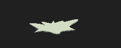|
| Air Jump VFX |Plays when double jumping or wall jumping|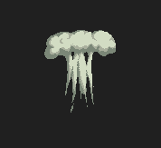|
| Landing VFX |Plays after a bigger fall||
| Dash Trail |Shows when the player is dashing||

> Add screenshot images using: ``

---

### 4.2 Cut Scenes & Cinematics

| Cut Scene | Trigger | Description | Screenshot / Still |
|---|---|---|---|
| N/A |N/A|No cut scenes used|N/A|

> Add screenshot images using: ``

---

### 4.3 Animations

| Animation | Object / Character | Description | Screenshot |
|---|---|---|---|
| Death Explosion |Player|Explosion when the player dies|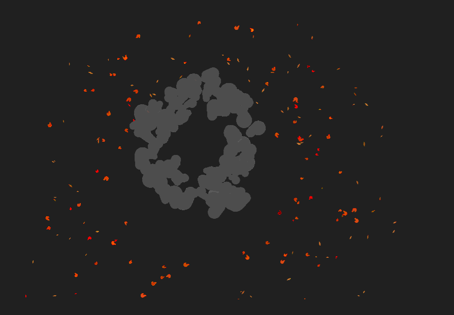|
| Jump VFX |Player|Smoke effect when jumping|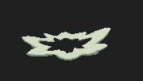|
| Air Jump VFX |Player|Smoke effect when double jumping or wall jumping|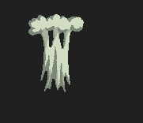|

> Add screenshot images using: ``

---

### 4.4 Lighting & Post-Processing

| Feature | Description | Screenshot |
|---|---|---|
| N/A |No lighting or post-processing used|N/A|

> Add screenshot images using: ``

---

### 4.5 Shaders & Materials

| Shader / Material | Applied To | Description | Screenshot |
|---|---|---|---|
| Default Sprite Material |Sprites|Used for normal 2D sprites|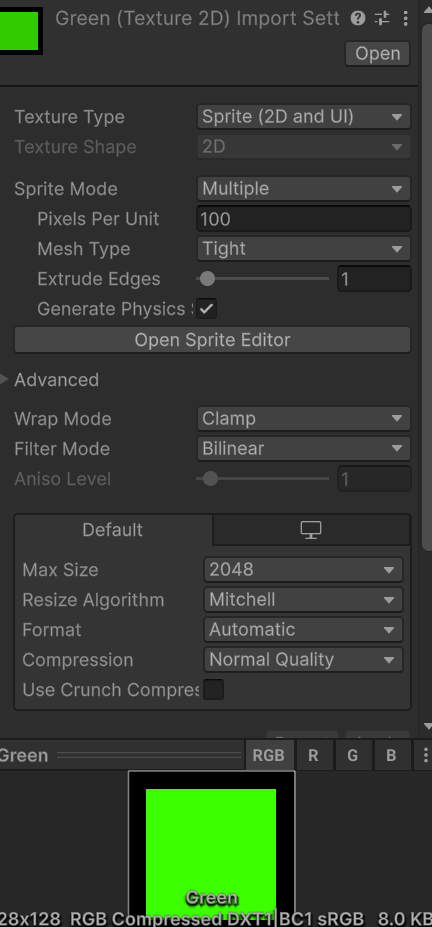|
| Default UI Material |UI|Used for buttons and menus|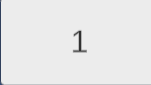|
| TextMeshPro Material |Text|Used for game text|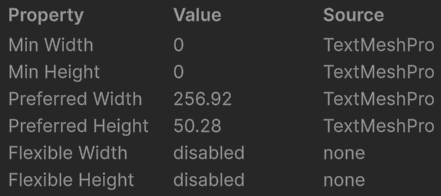|

> Add screenshot images using: ``

---

### 4.6 Additional Visual Screenshots

<!--
  Add any other notable screenshots here.
  Syntax: 
-->

| Description | Screenshot |
|---|---|
| N/A |N/A|

---

## 5. Audio Design

### 5.1 Music
| Track | Scene / Trigger | Source / Composer |
|---|---|---|
| N/A |No music used|N/A|

### 5.2 Sound Effects
| Sound Effect | Trigger | Source |
|---|---|---|
| N/A |No sound effects used|N/A|

### 5.3 Audio Implementation
| Feature | Description |
|---|---|
| Audio Mixer / Groups |N/A|
| Spatial / 3D Audio |N/A|
| Dynamic Audio |N/A|

---

## 6. User Interface & HUD

### 6.1 HUD Elements
| Element | Purpose | Screenshot |
|---|---|---|
| Timer |Shows current time|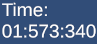|
| Best Time |Shows fastest time|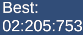|
| Arrow |Points towards the finish||

> Add screenshot images using: ``

### 6.2 Menus
| Menu | Purpose | Screenshot |
|---|---|---|
| Main Menu |Level select acts as the main menu|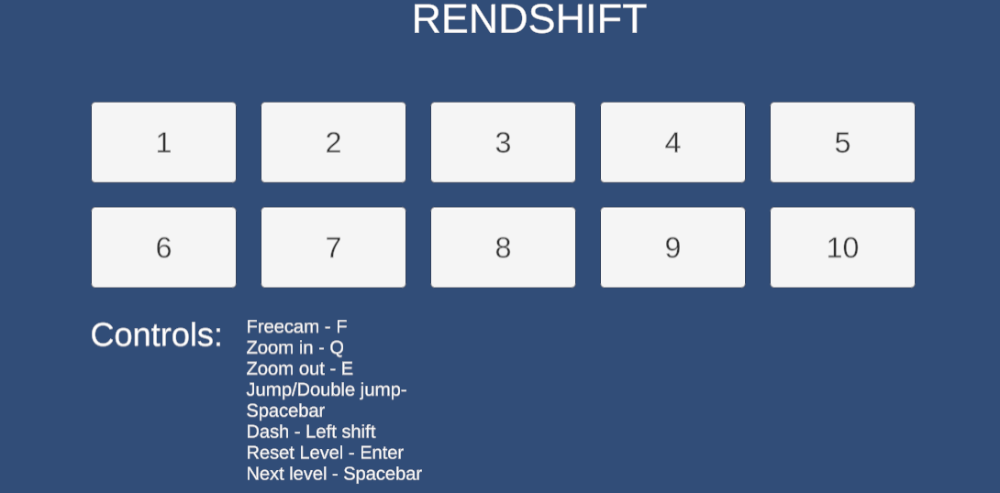|
| Pause Menu |N/A|N/A|
| Game Over Screen |Shows when the player dies|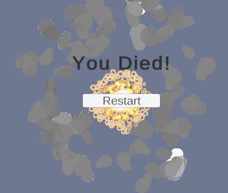|

> Add screenshot images using: ``

---

## 7. Scene & Level Design

### 7.1 Scene List
| Scene Name | Purpose | Description |
|---|---|---|
|Test Level|Mechanics/Script/Object testing|A level made to test new objects/scripts/mechanics before implementing into other levels|
|Level 1|Introduction|First level|
|Level 2|Introduce jumping|Second level|
|Level 3|More advanced jumping|Third level|
|Level 4|Introduce spikes|Fourth level|
|Level 5|More spikes and jumps|Fifth level|
|Level 6|Introduce wall climbing|Sixth level|
|Level 7|Introduce falling platforms and false platforms|Seventh level|
|Level 8|Combination of mechanics|Eighth level|
|Level 9|More advanced mechanics and no dash zone|Ninth level|
|Level 10|Combination of all previous mechanics|Final level|

### 7.2 Level / Environment Screenshots
| Level / Area | Description | Screenshot |
|---|---|---|
| Level 1 |Starting level|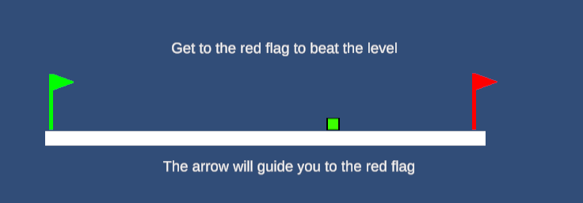|
| Level 6 |Wall jumping level|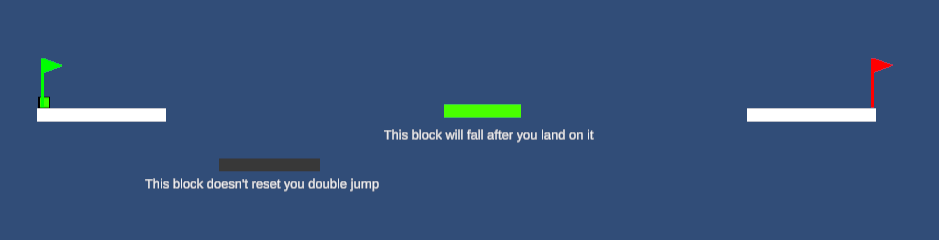|
| Level 10 |Final level using previous mechanics|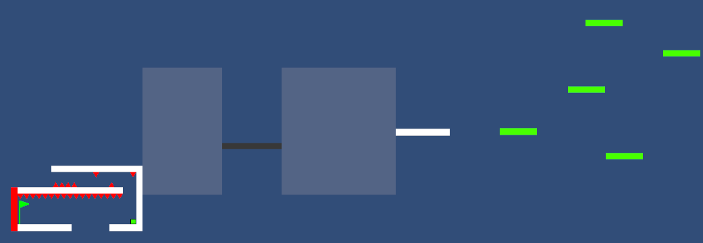|

> Add screenshot images using: ``

### 7.3 Scene Management
| Feature | Description |
|---|---|
| Scene Loading Method |SceneManager loads and restarts levels|
| Persistent Data Between Scenes |Saves best times and unlocked levels|
| Scene Transition Effects |Direct scene loading|

---

## 8. Scripts & Programming

### 8.1 Script Summary

| Script Name | Attached To | Responsibility |
|---|---|---|
|ArrowPointer.cs|Arrow|Points towards the finish|
|BestTime.cs|BestTimeText|Stores and shows best time|
|CameraFollow.cs|Maincam|Follows player|
|CameraModeSwitcher.cs|CameraManager|Switches between player camera and freecam|
|DashTimer.cs|N/A|Currently unused|
|DeathExplosion.cs|DeathGif|Death explosion animation|
|DeathHint.cs|DeathHint|Shows a hint after dying|
|DeathHintState.cs|N/A|Keeps the hint after restarting the same level|
|DestroyAfterAnimation.cs|VFX|Destroys VFX after the animation finishes|
|FallingPlatform.cs|FallingBlock|Makes platforms fall|
|FinishBlock.cs|End|Finishes the level and unlocks the next level|
|FreeCamController.cs|Freecam|Controls freecam movement and zoom|
|GameManager.cs|GameManager|Spawns player|
|Kill.cs|KillBlock|Handles player death|
|LevelSelect.cs|LevelSelect|Controls level selection and locked levels|
|NoDashZone.cs|NoDashZone|Stops dashing in certain areas|
|PlayerMovement.cs|Player|Controls player movement, jumping and dashing|
|Restart.cs|Death UI|Restarts the level|
|RunManager.cs|RunManager|Handles player spawning|
|Timer.cs|TimerText|Controls the timer|
|UIMANAGER.cs|UIMANAGER|Controls menus and level loading|

### 8.2 Key Algorithms / Logic
| Feature | Script | Description |
|---|---|---|
| Momentum |PlayerMovement.cs|Builds speed while moving in the same direction|
| Dash Direction |PlayerMovement.cs|Allows dashing in different directions|
| Level Unlocking |FinishBlock.cs / LevelSelect.cs|Unlocks the next level after finishing|

### 8.3 Design Patterns Used
| Pattern | Where Applied | Justification |
|---|---|---|
| Singleton |RunManager.cs|Allows other scripts to access RunManager|
| Components |Game objects|Different scripts control different features|
| State System |CameraModeSwitcher.cs|Tracks if freecam is on or off|

---

## 9. Development Techniques & Tutorials Acknowledged

> List every tutorial, course, video, or article that informed or guided your implementation. Include what you used it for and what you changed or adapted.

| # | Title | Author / Creator | URL / Source | What You Used It For | What You Changed / Adapted |
|---|---|---|---|---|---|
| 1 | How To Dash In Unity | YouTube tutorial | https://www.youtube.com/watch?v=2kFGmuPHiA0 | Making the dash mechanic | Changed the dash speed and directions |
| 2 | How To Make 2D Falling Platforms In Unity | YouTube tutorial | https://www.youtube.com/watch?v=uzbMPEkkSmo | Making falling platforms | Changed timing to fit my levels |
| 3 | 2D Player Movement In Unity | YouTube tutorial | https://www.youtube.com/watch?v=K1xZ-rycYY8 | Basic player movement | Added momentum and changed movement values |
| 4 | How To Double Jump In Unity | YouTube tutorial | https://www.youtube.com/watch?v=RdhgngSUco0&t=5s | Making double jumping | Changed jump values and added VFX |
| 5 | How To Wall Slide & Wall Jump In Unity | YouTube tutorial | https://www.youtube.com/watch?v=O6VX6Ro7EtA | Making wall sliding and wall jumping | Changed wall jump force and added wall jump VFX |
| 6 | Unity help | OpenAI ChatGPT | ChatGPT | Debugging and improving scripts | Changed and adapted suggestions to fit game |

---

## 10. Third-Party Content Acknowledgements

> All third-party assets (art, audio, fonts, scripts, packages) must be listed here with their licence. Using an asset without acknowledgement may constitute academic misconduct.

### 10.1 Visual Assets
| Asset Name | Type | Creator / Source | Licence | URL | Used For |
|---|---|---|---|---|---|
| Smoke and Dust VFX |Animation|Frostwindz|Free asset|https://frostwindz.itch.io/pixel-art-vfx-smoke-dust-free-version|Jump effects|
| Death Explosion |Animation|unkown|unkown|unkown|Death animation|
| Player Sprites |Sprites|Own sprite|Owned|N/A|Player|

### 10.2 Audio Assets
| Asset Name | Type | Creator / Source | Licence | URL | Used For |
|---|---|---|---|---|---|
| N/A |No audio assets used|N/A|N/A|N/A|N/A|

### 10.3 Scripts & Code Snippets
| Script / Snippet | Source | Licence | URL | Used For | Changes Made |
|---|---|---|---|---|---|
| Basic player movement |2D Player Movement In Unity|N/A|https://www.youtube.com/watch?v=K1xZ-rycYY8|Horizontal movement|Changed movement values and added momentum|

### 10.4 Unity Packages & Plugins
| Package Name | Version | Source | Licence | URL | Purpose |
|---|---|---|---|---|---|
| Universal Render Pipeline |17.0.4|Unity|Unity Licence|Unity Package Manager|Rendering|
| Input System |1.14.2|Unity|Unity Licence|Unity Package Manager|Input|
| 2D Feature Set |2.0.1|Unity|Unity Licence|Unity Package Manager|2D tools|

### 10.5 Fonts
| Font Name | Creator / Source | Licence | URL |
|---|---|---|---|
| Liberation Sans |TextMesh Pro|SIL Open Font Licence|Included with Unity|

---

## 11. Challenges & Solutions

| # | Challenge Encountered | How It Was Solved |
|---|---|---|
| 1 |Movement did not feel fast enough|Added a momentum system|
| 2 |Diagonal dashes were too strong|Lowered the power of diagonal dashes|
| 3 |Freecam caused problems with movement and timer|Paused the player and timer while using freecam|
| 4 |VFX stayed in the scene|Made them destroy after the animation finishes|
| 5 |Level progress needed to save|Used PlayerPrefs|

---

## 12. Branch Development Summary

> One section per feature branch. Add or remove sections to match your repository. Branches should be named for the feature they implement e.g. `feature/player-movement`. Link each branch name directly to the branch in your GitHub repository.

---

### Branch 1 — `main`

| Field | Detail |
|---|---|
| **Branch Name** | `main` |
| **Purpose** | Stable, releasable version of the game |
| **Merged From** | `Level-Transition`, `Freecam` |
| **Final Commit** | `d53c54d` |

---

### Branch 2 — `feature/`

| Field | Detail |
|---|---|
| **Branch Name** | `Level-Transition` |
| **Feature Developed** | Level transitions |
| **Merged Into** | `main` |
| **Date Started** | 17/06/2026 |
| **Date Merged** | 17/06/2026 |

#### What Was Built
Added level transitions allowing the player to move between levels after finishing.

#### Key Commits
| Commit Message | What Changed |
|---|---|
| WIP : Level transitions |Worked on level transitions|
| Completed Level Transitions |Finished level transitions|

#### Problems Encountered & Resolved
| Problem | Resolution |
|---|---|
| Levels did not transition properly |Fixed the level loading system|

#### Screenshot / Evidence
<!-- Add a screenshot of the feature working -->
> ``
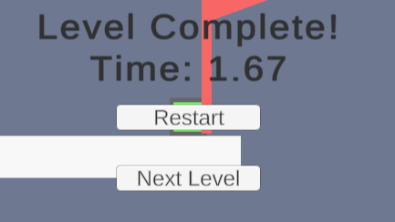
---

### Branch 3 — `feature/`

| Field | Detail |
|---|---|
| **Branch Name** | `Freecam` |
| **Feature Developed** | Freecam |
| **Merged Into** | `main` |
| **Date Started** | 05/08/2026 |
| **Date Merged** | 26/08/2026 |

#### What Was Built
Added a freecam allowing the player to move around and view the whole level.

#### Key Commits
| Commit Message | What Changed |
|---|---|
| WIP : Moving camera |Started camera movement|
| WIP : Freecam |Worked on freecam|
| Freecam |Fixed freecam problems|

#### Problems Encountered & Resolved
| Problem | Resolution |
|---|---|
| Freecam caused problems with normal gameplay |Fixed camera switching and pausing|

#### Screenshot / Evidence
> ``
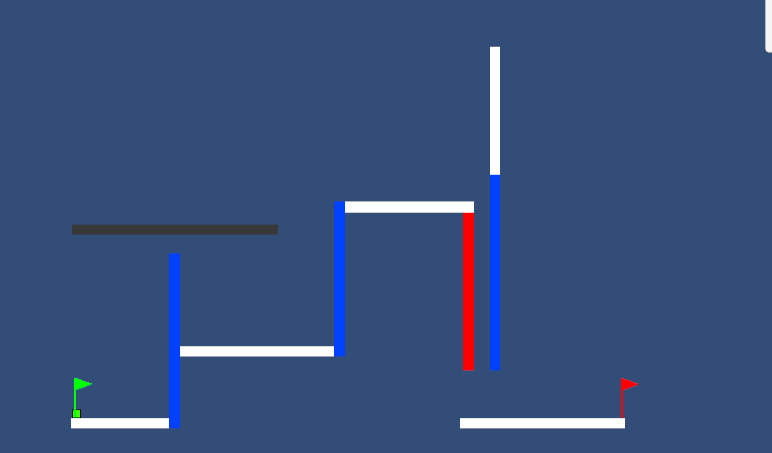
---

### Branch Development Overview

> Complete this summary table once all branches are finished.

| Branch Name | Feature | Date Started | Date Merged | Status |
|---|---|---|---|---|
| `main` | Stable release |13/05/2026|N/A|Active|
| `Level-Transition` |Level transitions|17/06/2026|17/06/2026|Completed|
| `Freecam` |Freecam|05/08/2026|26/08/2026|Completed|

---

> **Student Declaration:** All work submitted is my own except where explicitly acknowledged above.